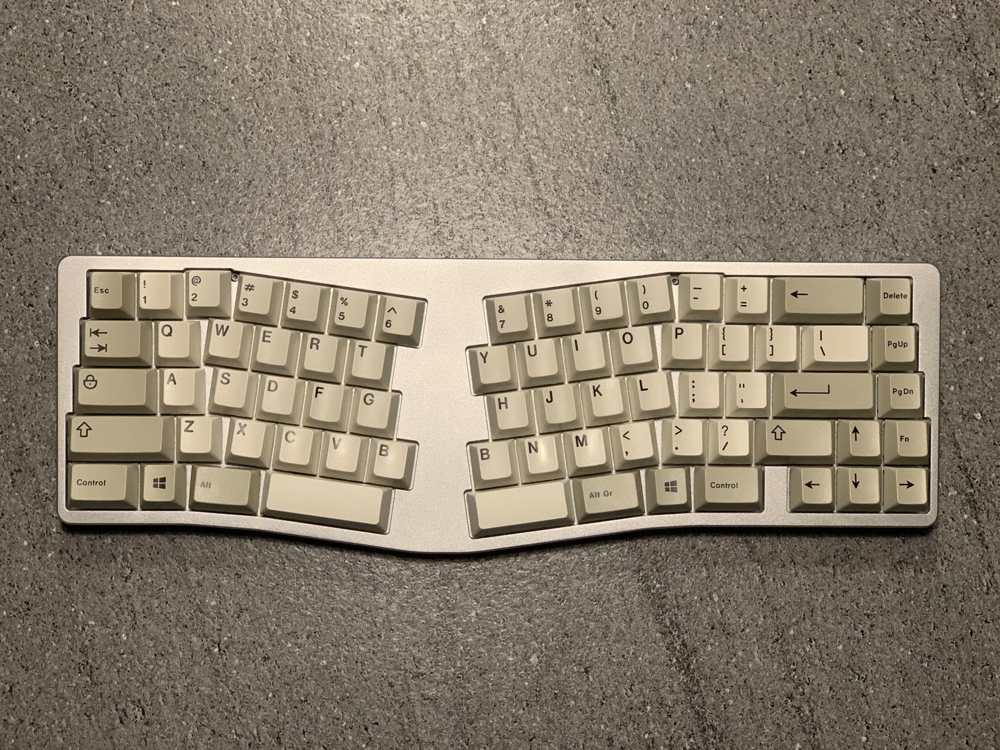
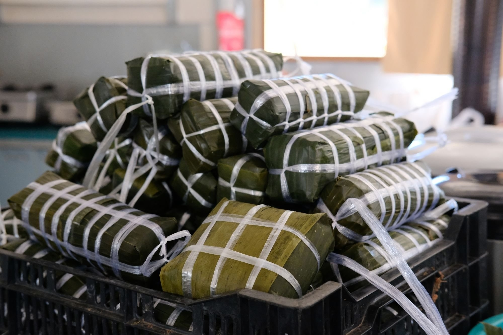

    
    <em classname="img-caption">Illustration from Gettys Images</em>

IT'S BEEN A while, or should I say: too long, since my last blog post. As with anything, life moves on and I still encounter loads of things I wanted to share on this platform. And what better way to celebrate this comeback other than giving a quick rundown on the past several months (my work, study, and forseeable plans).

You may, or may not, have noticed that my new formatting differs from that of the previous posts. Since December, I have picked up on reading daily (mostly on WIRED.com). And in the realm of reading, a few that I went through consists of *The Diary of a Young Girl*, *Don Quixote*, *Competitive Programming 3 by Steven Halim*. Reasons for this newly acquired habit is that: one, I long to write better, and two, to prepare myself for university (yes, seems absurb, but I was not the reading kid back then).

Without further ado, let me present what I had done so far:

## Keyboard(s)

    
    <em classname="img-caption">Noxary Valhalla, an enthusiasts' keyboard in the Alice layout</em>

From where I had left off in the last post (sorry, I did not have the time to continue another instalment of the keyboard series), I have finished it !!!!!!!!!!!!!!!!!!. Despite changing the keycaps and caught up in some problems, it is fully functional and types like any other keyboards. You can check it out here: **ATTACH THE IMGUR LINK, DO NOT FORGET THIS STUPID ME!**.

I had to address a few things, however. One noteworthy issue is that the plate cutouts' were a tad too small; thus the switches could not fit in properly. **SOLUTION, I hear you asked?** I had to spend 3 days sand down each and every one of the hole laboriously by hand. Phewwwwww, such a time sinker. Another thing is that I had used 2 small acrylic pieces as the legs of the keyboard. They work well, just not the prettiest.

Overall, I was decently happy with the endproduct. Would give it a solid 11/10 for my efforts in filing down all those 70 holes.

## CAD (not PCB design) but Fusion360

If you don't already know, it is essentially 3D Modelling, and is what those Mechanical Engineering Undergrads study.

After finishing the aforementioned keyboard above, I decided that I will do another keyboard, albeit in aluminium this time. And that will be the last one. As I don't have much money, I can't shill out a fortune (around $3xx or $4xx is what enthusiasts' projects will quote you for) on a piece of rectangle. Hence why I picked up on 3D Modelling skill. And to be frank, I did thought about double major slash minor in Mechanical Engineering after spending much time in designing stuffs.

Initially, it was quite tedious and painful, but I slowly overcame that seeing that many people could do it and how I could transform my creativity into something tangible! I did use Youtube as the main resource. There I watched channels such as [hali](https://www.youtube.com/@hali4045/videos) and [quantrik](https://www.youtube.com/watch?v=4P0zfLLblOw) for guidance. Another source of information I ultilized was [github](https://github.com) as well as [geekhack](https://geekhack.org) for inspirations. I have been indulging in the sphere of keyboard designs for roughly 3 months now, and that will probably end soon enough.

I have made quite a few keyboards during my break. Additionally, I'm starting to look for a manufacture here in VietNam for machining my first prototype (I have plans to run a small business scheme selling custom keyboards in the forthcoming future to make funds for my uni education).

Do note that in the upcoming few days, I will upload them to my github. So if interested, please keep an eye out for my edits to this post as I will attach the link HERE once it is up.

## Programming

Eversince the admissions cycle started around October and throughout the Q4 of 2022, I was busy studying SAT along writing essays. *Am I blaming those for my lack of time to do competitive programming?* No, and not in the slightest. So yes, I reunited with programming on the second of February, and have finished the book by Steven Halim to get my feet back in the water. Eversince, grinding problems has been my daily chore.

Not much to say in this section. Though I have plans to occasionally post about some problems and how I tackle them as food for thoughts.

Another that have bugged me quite alot is this blog. No, not the act of writing and publishing my thoughts onto the internet. Instead, it is how I structured and programmed this blog. For some reasons, I'm having troubles when attaching images to my site, as shown in the previous keyboard build log. I plan to do an overhaul from the internal and inners of it so that I can have a sustainable means of jotting my ideas down and push it online.

Wait for me!! This site may change in the future but my daily writing will not change!!!!

## Studying / Admissions Results

For my school, we're approaching the middle of the second semester exams. Meaning less time for soccer and more densed schedule. Ahah, but that won't deterred me from writing blog daily tho. I find it similar to meditation and I could exercise my writing more!

As for universities and application cycle, I'm waiting Middlebury and Swarthmore as well as UCF, Lafayette and a few others to release their decisions. I'm hope that I could attain a spot in a good school while keeping the cost under managed. And from the universities that I got into, I was mostly keen on Gettysburg, one of the admission officer who interviewed me was very nice and I wish to have chat with him around the campus one day. Still looking forward to having breakfast with you, Luke!! During the interviewed, we talked about school, yes, and my hobby, I also told him a few things about Social Engineering/Cyber Security (still learning it). Such fun, especially when that was on **Tet Holiday**. On that note, I shall discuss with you about my Tet's break and our school trip next.

To all admissions officers and school representatives, thank you so much for you time, dedication towards me, a 17-year-old who are applying to your insitutions. I wish you all have a good year and much love from Vietnam. Thank you for your responses to some of my childish questions, thank you for your time reading through what I wrote in my essay, and much thanks if you are reading this right now!!!

## School trip et Tet holiday

    
    <em classname="img-caption">Illustration from Gettys Images</em>

In January, our school decided that a four-day-trip will be held as none was organized from the last 2 years. Me and the boys were eagered to explore and spend our moments at Dalat, where the trip was held in. And exceed our expectations, it was packed with memories. Not that the school did a good job. They did decent, but what made it home was: me, my friends. That's it! Although the food was cold, dry, and hard to swallow, although our usher was not at all enthusiastic, we had ton of fun (it was in fact so fun that I had thought of writing a blog about it on the day home, I did not because....I forgot why). Anyways, here are some of it before it is too late:

- **Before I list any of it, thank you Trung (friend since grade 1), Trong, Minh, Thien, without you the trip wouldn't be as fun as it did. Will miss you alot when I go to uni.**
- I went to the NET (Internet Cafe) for the first time. We also upsetted Huy Minh by telling our teacher we went to the NET and had to implement an Oscar-Level plan that day.
- I got a chance to sleep in the same room as my friends. Much laughter, much fun!
- Despite being bad at it, I still played soccer with them.
- We attempted to escaped the Gong musical night (not sure if I imparted it well), but failed :^). Still, unforgotten memories.
- We had a big fight over the dirty bathroom mat, which we had to pay $5 for the cleaning fee.
- I got into 2 universities while we were on the trip.
- I had an interview with Luke at Gettysburg on the day home.
- And much more....

For the Tet holiday, I was busy writing essay to NUS; however, I still alocated time to make Banh Chung with my family and a few other members in our Emmanuel Catholic Community. I visited grandparents just like any other year. This year felt particularly special since it may well be the last Tet I spent with my family if I continue higher education abroad. I got lots of Li xi, very grateful since I wanted to try out the stock market in 2023. Our family also went to the Nguyen Hue Walking street where they exhibited flowers and statues of the Cat. Well, it's been long enough that there are probably things that I forget about this Tet holiday, but the spirits is still there. Still Banh Chung, still Li xi, still Chuc Tet, still red and green, and still Thit Kho Trung!

## At last, cooking!

Recently, I made a few cookies. A fun experience considering I have never baked before! I learned that I'm not very hygenic when baking and how hard it is. I will try to make many more cakes in the future with mom and my sister. Thank you you two for *carefully* and *patiently* wait for me to churn the dough and shape the cookies. Should I make those Korean Fluffly Cakes next? What you do think?

## End,

To conclude this lengthy blog, I promise that I will keep up the daily blogging and will finish the blogs I wrote before. Today I haven't read any news but I will do later when I upload this blog. Thank you so much for your time and hope you had a good day!

Yours,
Thuc
