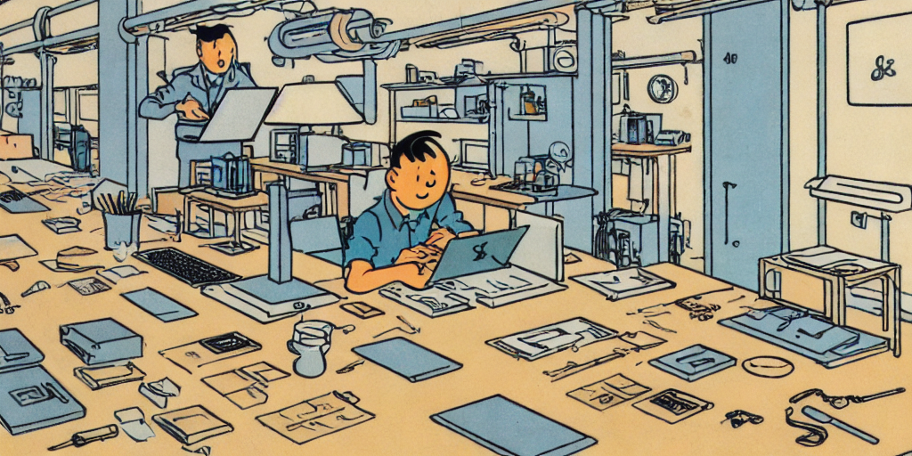

    
    <em classname="img-caption">Image generated with Stable Diffusion -- man coding on a laptop in herge style</em>

I had the chance to come across a Data Science competition while learning Machine Learning this summer. The contest is organized by Foreign Trade University with the aim to provide a playground for teams of 3 to pitch their solutions to modern problems using Machine Learning. I managed to convince one of my close friend *(Khoi, thank you bro)* to join in with me as my knowledge in Data Analytics is still immature. Before I mainly worked with web and low-level systems like kernels and even reverse enginneering *(I will do more blogs regarding these subjects in the future)* so having someone taking care of the predictions is crucial. Since our team was missing one person, Khoi invited his friend to complete the set of 3.

We decided to create a web for predicting the air quality and weather from the daily updated dataset. Reasons for choosing this is:
1. Easily intergrable
2. More accurate
3. Realistic

>How could I know if it is more accurate tho?

>We use a range of prediction models and then cherry pick the best one accordingly

>Ohh thank you, and what about the *Realistic* part, can you explain?

>My initial plan was to guess the value of the poker cards from a small snippet of it using realtime video analyzing. That didn't turn out too well (though I would love to do it in the foreseeable future) so we switched up the roadmap and went with this.

In the first rounds, submissions required were PDFs and Video explaining the motives and uniqueness of our product. But for the finale, participants needed to travel to Hanoi to compete against each other. There was luckily travel aid for those like myself who live in the Southern part of Vietnam and have to fly to Hanoi, the North only to take part in the last round.
